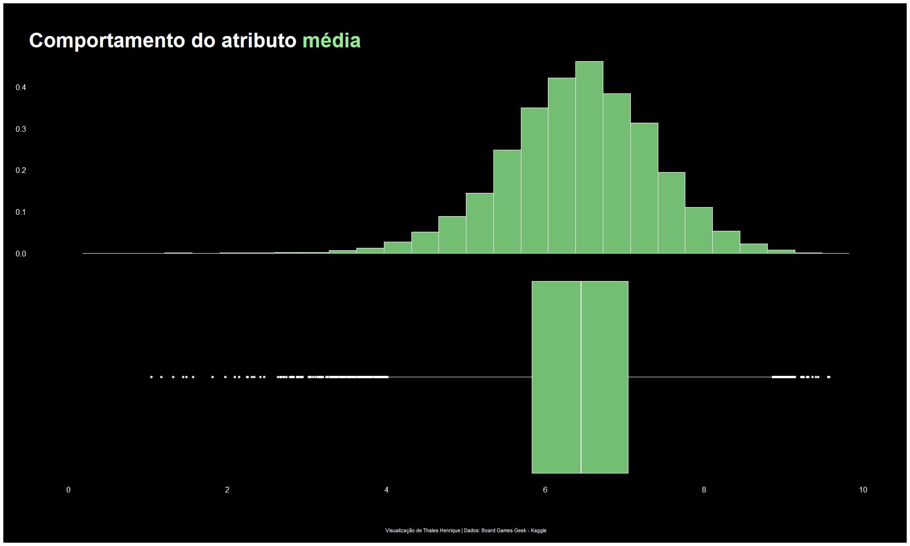
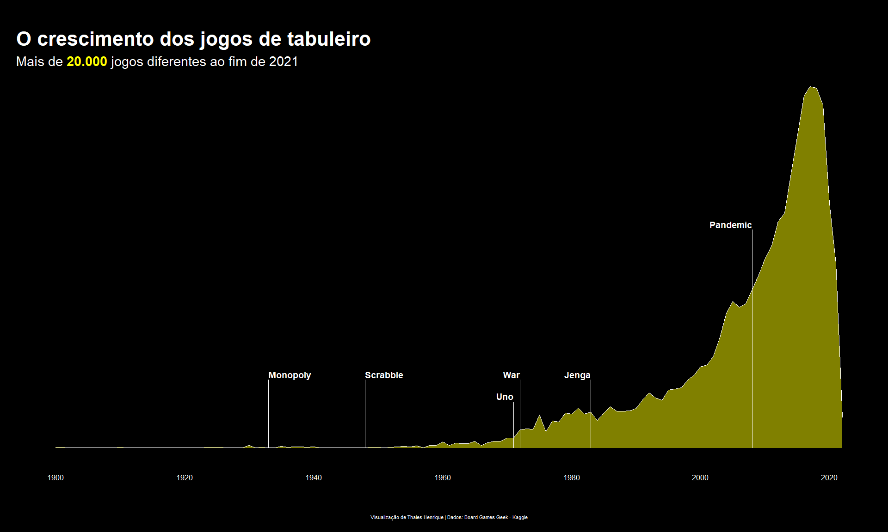
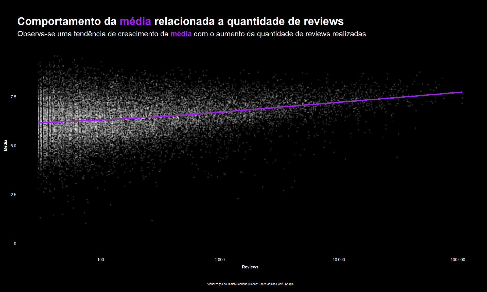
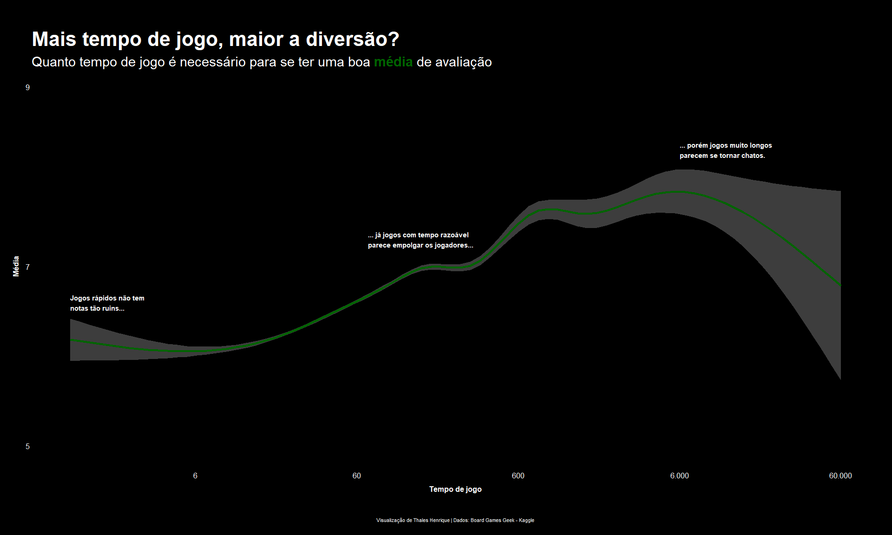

Visualização de dados
================

# Introdução

Nesse projeto será apresentado o trabalho final do curso de
Visualizalção de Dados da [Curso-R](https://curso-r.com/). A proposta
foi de realizar um atividade na qual produziremos gráficos com as
ferramentas estudadas durante o curso. Para tanto foi utilizado o
conjunto de dados sobre jogos de tabuleiros disponibilizados pela [Board
Games
Geek](https://www.kaggle.com/datasets/jvanelteren/boardgamegeek-reviews)
na página da Kaggle. Porém foi utilizada uma versão mais compacta do
conjunto de dados usada como base para um
[TidyTuesday](https://github.com/rfordatascience/tidytuesday/blob/master/data/2022/2022-01-25/readme.md).

## Primeira Visualização

<!-- -->

## Segunda Visualização

Ao longo do tempo surgiram vários jogos de tabuleiro. A partir do século
XX se intensifica a criação desse tipo de entreterimento. Nessa primeira
visualização vamos ver o crescimento da quantidade de jogos a partir do
ano de 1900 aaté o fim de 2021. Nele foi marcado alguns dos jogos que
mais tive acesso e joguei durante a minha infância e adolescência.

<!-- -->

## Terceira Visualização

Nesse comjunto de dados há um atributo chamado `users_rated`. Esse
atributo nos diz a quantidade de usuários que deram uma nota a um
determinado jogo. Nessa próxima visualização a ideia é tentar ver se a
tendência da média das avaliações é crescer ou diminuir com a quantidade
de vezes que o jogo foi avaliado pelos usuários.

<!-- -->

Um detalhe nesse gráfico é que a escala do eixo x é uma escala
logarítmica de base 10, já que temos jogos que foram avaliados dezenas
de vezes e jogos que chegam a centena de milhar de avaliações. Sendo
assim, conseguimos ver uma tendência de aumento da média quando os jogos
possuem bastante avaliações realizadas.

## Quarta Visualização

Um pouco parecido com o gráfico anterior, porém com uma proposta um
pouco diferente, temos nessa terceira visualização a comparação da
tendência da média quando comparamos com o tempo necessário para
finalizar o jogo de tabuleiro. Analisando os dados antes de criar esse
gráfico, descobri que há um jogo criado em 1979 que simula o teatro de
guerra do norte da Africa durante a segunda guerra mundial que tem tempo
médio de 60.000 minutos, vocês não leram errado, vou escrever novamente:
60.000 minutos, segue uma página para ver algumas fotos e reviews sobre
esse jogo, chama-se [The Campaign for North Africa: The Desert War
1940-43](https://boardgamegeek.com/boardgame/4815/campaign-north-africa-desert-war-1940-43).

<!-- -->

Aparentemente os jogos com tempo de jogo mediano para a sua finalização,
na faixa dos 10 - 1000 minutos, são os que possuem um tendência de média
crescente bem estável. Agora jogos com mais de 6.000 minutos de duração
possuem um tendência de queda na média bem acentuada. Também seria de se
estranhar se essa média não caisse, jogos muito longos tornam-se chatos.
